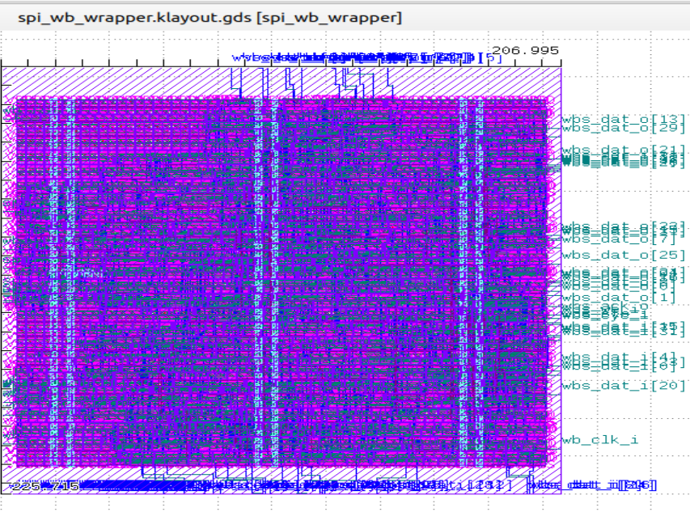

# SPI-AES Subsystem: RTL-to-GDSII Physical Design Flow

## Overview
This project demonstrates a complete Physical Design (PD) flow for an **SPI-AES Subsystem**. Using the **Librelane** framework and **OpenROAD** engine, the design was implemented from RTL netlist to a production-ready **GDSII** layout.

## Key Technical Specifications
- **PDK**: IHP 130nm / SkyWater 130nm.
- **Tools**: Librelane, OpenROAD, Magic (DRC), Netgen (LVS).
- **Core Modules**: SPI Wrapper, AES Core, Synchronizers, and Edge Detectors.

## Physical Design Highlights
- **Synthesis & Constraints**: Applied rigorous timing constraints using `pnr.sdc` to guide the placement and routing phases.
- **Floorplanning**: Optimized core utilization and power grid (PDN) to ensure minimal IR-drop.
- **Clock Tree Synthesis (CTS)**: Achieved balanced clock distribution for high-frequency synchronization modules (`synchronizer.sv`, `reclocking.sv`).
- **Timing Sign-off**: Verified final timing convergence using `signoff.sdc` to ensure zero setup/hold violations.
- **Physical Verification**: Successfully passed **DRC (Design Rule Check)** and **LVS (Layout Vs Schematic)** with zero errors.

## How to Reproduce
1. Install Librelane environment.
2. Place the RTL files in the `design/` folder.
3. Run the flow:
   ```bash
   librelane run config.json



